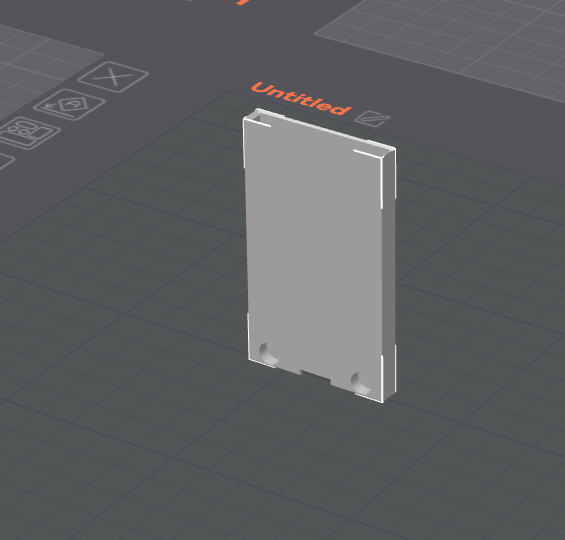
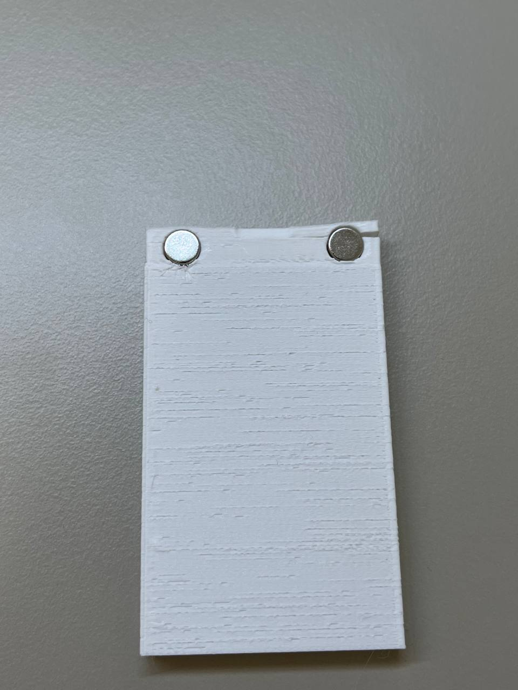
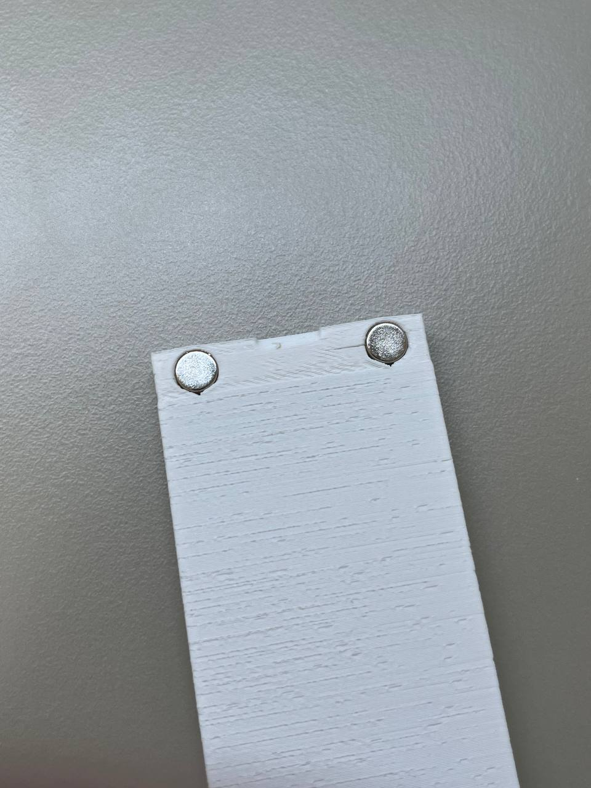
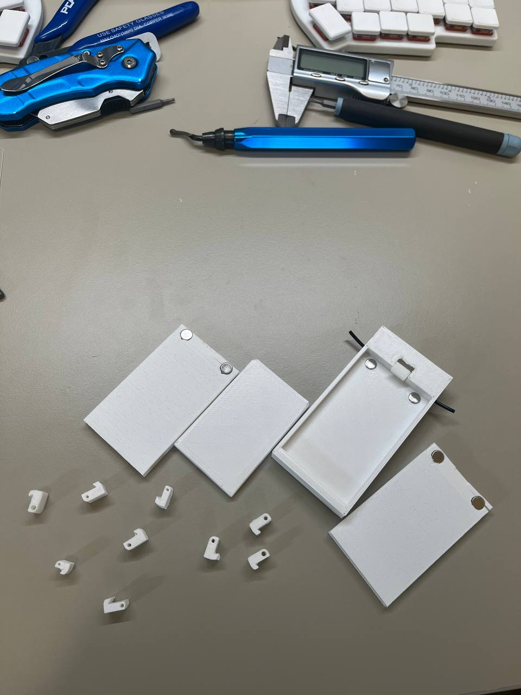
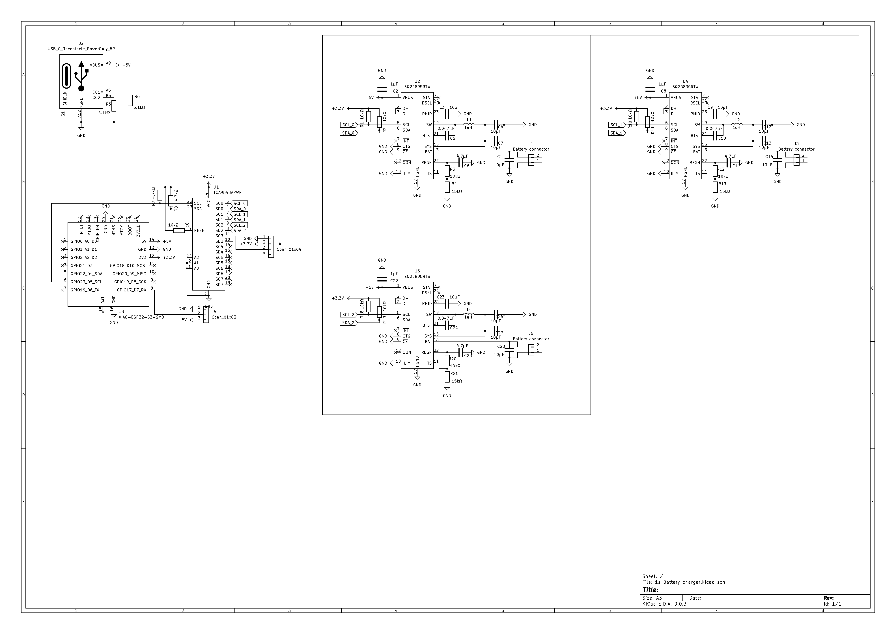
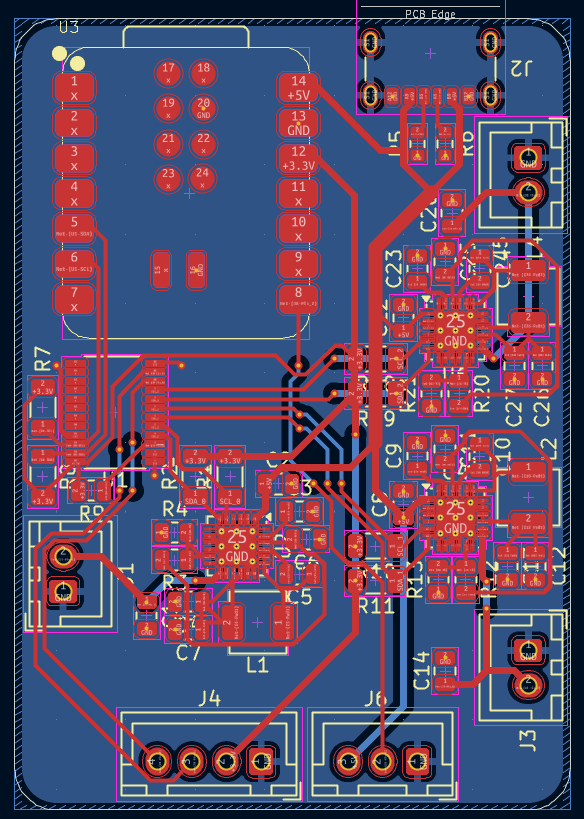
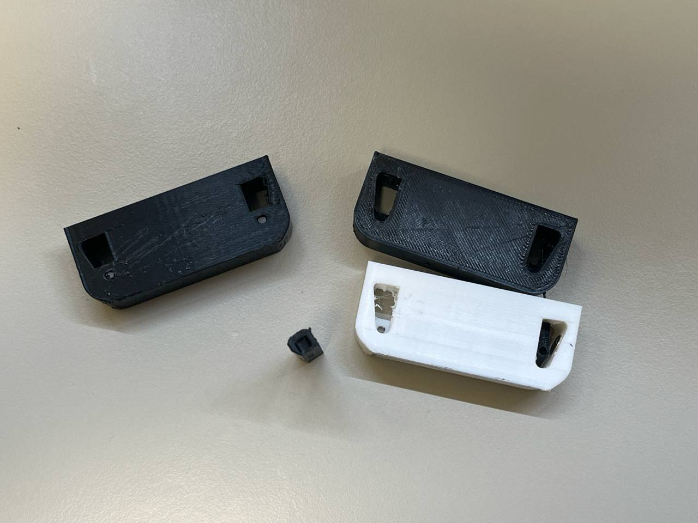
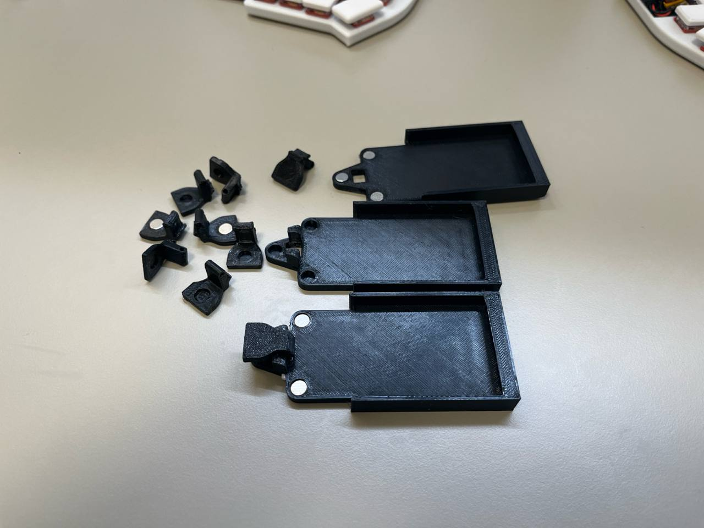
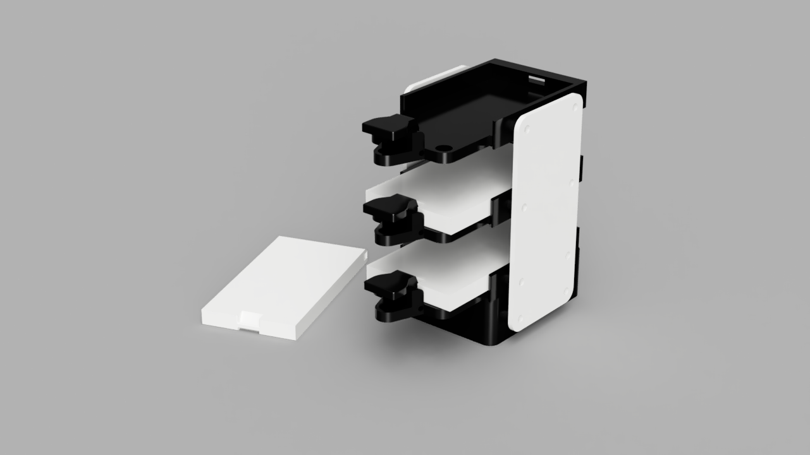

# Total time spent: 20h

# July 1st: Got quick release mechanism to work.

As my CAD of choice I used Fusion 360. 

There, I first designed and 3D printed a simple battery model to make sure that the rest of the build will be compatible with it since I do not have batteries yet. 
Then, I started working on a battery shell to house the battery in. By trial and error, I figured out that the best settings that worked were 0.5mm outer walls with one perimeter on a 0.4mm nozzle printed in the following orientation:

Magnet holes at the bottom of the shell had to be made with an upside-down V shape at the top due to the printer's limited ability to bridge and holes orientation. The first iteration shell did not have those, resulting in the shell cracking when magnets were put in it. For the rest of the shells, the upside-down V shape was added and the issue was resolved. Below are pictures of the shell before and after the fix. 

Next, the mechanism was created.

The battery in the shell is repelled from the base up, where the locking mechanism does not let it go. Repulsion of the battery helps to hold it in position more securely and makes sure that even with time, the battery will stay in place and will not move no matter the tolerances. The lock uses another pair of magnets to make sure it is always in place and ensure a consistent battery insertion experience. This mechanism also uses a short piece of filament since it perfectly fits the small size of the mechanism. 

About 10 revisions of this lock were made before I was satisfied with the result. Its small size and imprecision of FDM 3D printing caused this challenge of getting reliable performance from this piece of mechanism. Below are most of the revisions of all parts that led to reliable and satisfying performance.

**Total time spent: 4h**

# July 3rd: Sorted out all the components needed

While charging a LiPo battery might seem like a trivial task at first, I had multiple requirements that made the choice of components way harder. Firstly, I want it to be a CC-CV charger, meaning that it starts charging with a constant current, slowly increasing the voltage and stays at 4.2V once it reaches it. This immediately rules out a simple solution of using simple circuitry to just give a steady 4.2 volts to the battery. Since these batteries have overcharge and overdischarge protection, this would probably work, but CC-CV can increase the longevity of the batteries. Another factor for me was the ability to monitor the battery state and the ability to stop the charging process from a microcontroller. 

At first I decided to use 2 ICs per battery: one for charging and one for monitoring. One of the candidates that I considered was a pair of MCP73831 as a charging IC and MAX17055 as a monitoring IC. This seemed like a great choice since it allows for getting a lot of information out of a battery, most importantly accurate battery percentage and battery health. 

However, after hours of consideration and reading datasheets and parts lists, I decided to pivot towards a different approach due to cost and PCB complexity considerations. I decided to use one IC for both charging and monitoring. After a bit more time spent looking at different options, I settled on using the BQ25895. It seems ideal since it does not require many additional components, making the PCB simpler, while still providing basic information about the battery such as voltage and current. However it has its own drawbacks such as limited information compared to the dedicated battery monitoring IC, but for the purpose of this project this is enough. 

Another challenge is that the charging IC is controlled via I2C protocol and its address cannot be changed, meaning that if I want to charge multiple batteries at the same time using the same controller, I need an I2C splitter and for that I used the TCA9548A - an 8 channel I2C splitter. 

For the microcontroller, I decided to use Seed Studio XIAO ESP32-C6 for its support of Zigbee, allowing me to connect it to my Home Assistant smart home with less dependence on wifi if I decide that I need this functionality. It also has a fairly small footprint allowing it to fit into the charger easily.

Overall, to find all those components, it took me a lot of time asking AI (Claude) for initial assistance to get to a starting point, searching through catalogs, reading documentation to finally settle on what I think are perfect components for my particular task. 

**Total time spent: 5h**

# July 6th: PCB making

Using the components mentioned above and appropriate datasheets, I started designing schematics for the PCB. I used [this](https://e2e.ti.com/cfs-file/__key/communityserver-discussions-components-files/196/BQ25895_5F00_SchematicChecklist-V1p1.pdf) schematics checklist I found online to ensure I used the right components for the BQ25895. 

After a couple hours, I had these schematics ready:

After that, I started designing the PCB. I decided to make a 2-layer PCB with one layer being a ground layer and the second one being a power and data layer. Although at the end, I had to make a couple of data and power traces going through the ground plane. 
I tried to make the PCB as compact as possible, more specifically make it smaller than the battery itself. 
After another couple hours, I had the PCB ready. Since I had a bit of space left on the board, I decided to include a connector for an I2C display as well as an addressable LED connector, in case I want to use any of that in the future. Here is the complete routed PCB:

For assembly, I decided to use JLCPCB assembly for most of the components, soldering only JST connectors and the ESP32 by myself, since JLCPCB does not have that board and I already have connectors, and I also don't have to pay an additional hand assembly fee in this case. 

The same day, I wrote some code for the charger, but since I do not have any of the hardware, it probably does not work, I will make sure it is working after I get PCB. 

Also, shared schematics and PCB layout on Reddit, got some advice from other people and improved it a bit.

**Total time spent: 5h**

# July 28: Back to CAD

After taking a break with this project, I came back to Fusion to design the charger module. I considered a couple of different designs. Initially I wanted to mount batteries on the charger vertically, but after designing some vertical locking mechanisms, I realized that with the precision of FDM 3D printer and the lack of space on the battery shell, it is nearly impossible to make a reliable and consistent locking mechanism. Here are some designs that I tried:

After that, I decided to do a similar design to the battery holder. This turned out much better than all the previous designs, so I decided to make it bigger by laying batteries flat, but ensure the reliability of the mechanism. After a series of prototypes, I ended up with something that worked well for me.

While all those small tabs might look the same, they are actually all different with some dimensions slightly changed. When I was happy with the charger module, I designed an enclosure for the charging PCB and side panels to connect all the modules together. 

Finally - Fusion 360 added constraints for components!!! The timing was just right (I wish they had done that earlier, but better late than never). With that, I was able to finish assembling the charger, which ended up looking like this:

**Total time spent: 4h**

# July 30: Last day

Finally, with all the components ready, I started writing the README.md file and looking over all the journals and putting all the files into the GitHub repo. I also used Grammarly to correct grammatical mistakes in my Journal. 

**Total time spent: 2h**