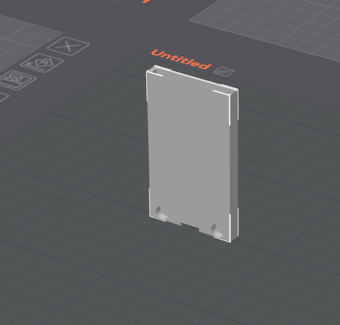
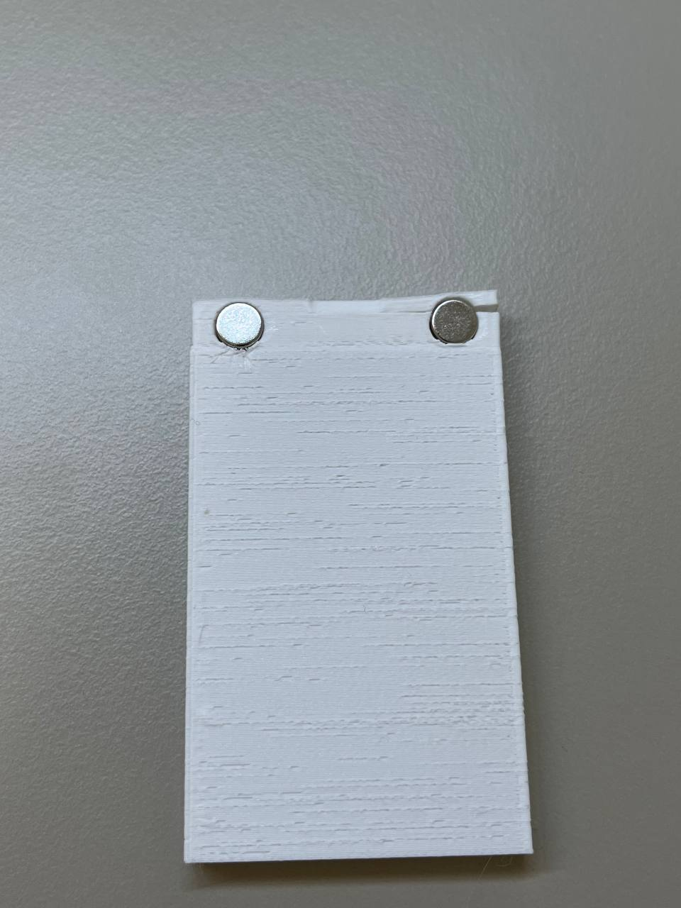
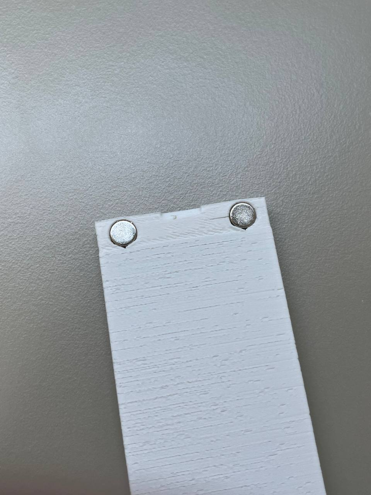
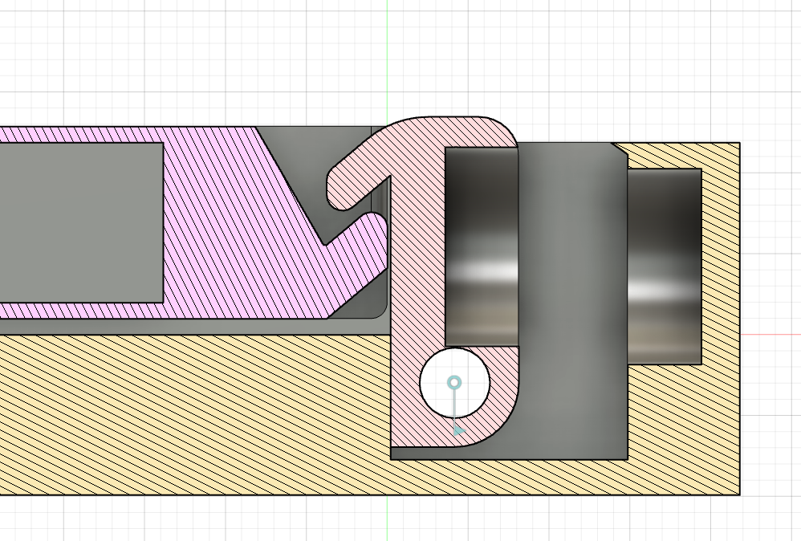
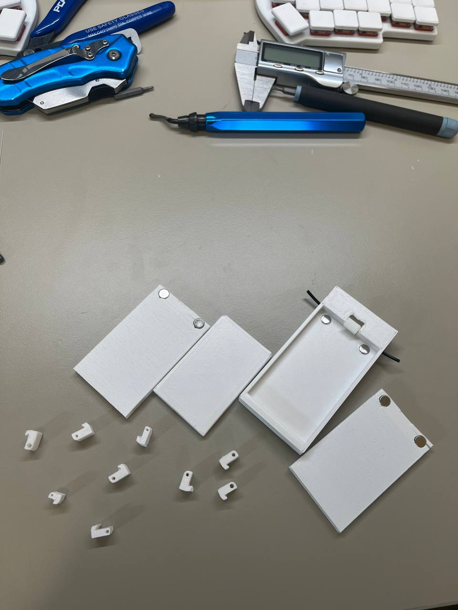

# July 1st: Got quick release mechanism to work.

As a CAD of my choice I used Fusion 360. 

There, I first designed and 3d printed a simple battery model to make sure that the rest of the build will be compatible with it since I do not have batteries yet. 
Then, I started on working on battery shell to house the battery in. By trial and errors, I figured out that the best setting that work was 0.5mm outer walls with one perimeter on 0.4mm nozzle printed in the following orientation:

Magnets holes at the bottom of the shell had to be made with a upside-down v shape at the top due to printer's limited ability to bridge and holes orientation. The first iteration shell did not have those, resulting in the shell cracking when magnets were put in it. For the rest of the shells, upside-down v shape was added and the issue was resolved. Below are pictures of the shell before and after the fix. 

Next, the mechanism was created.

The battery in the shell is repelled from the base up, where the locking mechanism does not let it go. Repulsion of the battery helps to hold it in the position more secure and makes sure that even with time, battery will stay in place and will not move no matter the tolerances. The lock uses another pair of magnets to make sure it is always in place and ensure consistent battery insertion experience. This mechanism also uses a short piece of filament since it perfectly fits in the small size of the mechanism. 

About 10 revisions of this lock was made before I was satisfied with the result. Its small size and imprecision of the FDM 3d printing caused this challenge of getting reliable performance of this piece of mechanism. Below are most of the revisions of all parts that led to a reliable and satisfying performance.

**Total time spent: 4h**