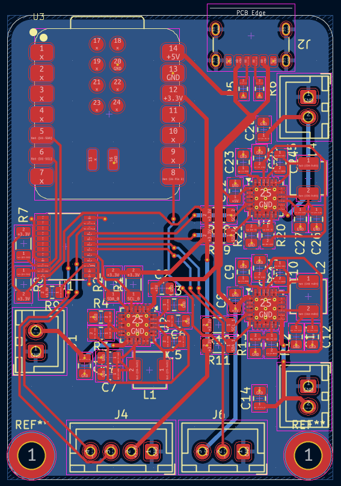

# universal-batteries

Are you tired that all of those "wireless" devices actually require wires to charge them? Are you tired of all those wires on your table? Do you want to build a DIY project but you don't know what batteries to use? Or maybe you are not sure if wireless is the solution due to inconveniences with charging? 

If you answered yes to any of that, this project is for you! I personally answered yes to all of them, so I decided to make this modular battery system, so they can be swapped in seconds and no wires will be needed to charge any of the wireless tech that I have (not all of them, but most of them). 

This project introduces a simple design of a battery shell, charger and module that can be inserted into any project (or even existing electronics) to make it support hot-swap batteries and make all project batteries compatible with each other. 

The design features a charging station to charge 3 batteries at a time controlled with an ESP32-C6 allowing wireless control over it, battery shell design supporting 503759 batteries (1200mAh), and a battery bay to integrate into any project. 

This project is a work in progress, none of the electronics have been tested yet, including firmware and PCB. 

Here is the routed PCB for the charger:

